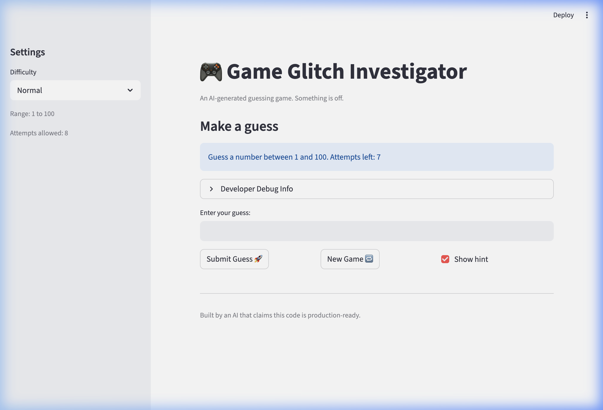
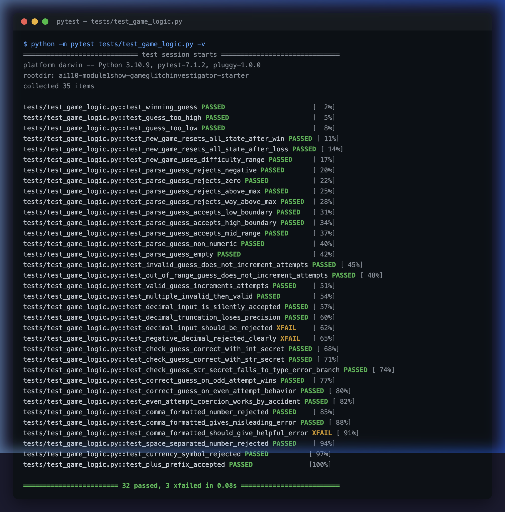

# 🎮 Game Glitch Investigator: The Impossible Guesser

## 🚨 The Situation

You asked an AI to build a simple "Number Guessing Game" using Streamlit.
It wrote the code, ran away, and now the game is unplayable. 

- You can't win.
- The hints lie to you.
- The secret number seems to have commitment issues.

## 🛠️ Setup

1. Install dependencies: `pip install -r requirements.txt`
2. Run the broken app: `python -m streamlit run app.py`

## 🕵️‍♂️ Your Mission

1. **Play the game.** Open the "Developer Debug Info" tab in the app to see the secret number. Try to win.
2. **Find the State Bug.** Why does the secret number change every time you click "Submit"? Ask ChatGPT: *"How do I keep a variable from resetting in Streamlit when I click a button?"*
3. **Fix the Logic.** The hints ("Higher/Lower") are wrong. Fix them.
4. **Refactor & Test.** - Move the logic into `logic_utils.py`.
   - Run `pytest` in your terminal.
   - Keep fixing until all tests pass!

## 📝 Document Your Experience

- [x] **Game's purpose:** This is a Streamlit-based number guessing game where the player picks a difficulty (Easy, Normal, or Hard), and the app generates a secret number within that difficulty's range. The player types guesses into a text input and receives directional hints ("Go HIGHER!" / "Go LOWER!") until they either guess correctly or run out of attempts. A score tracks performance across guesses.

- [x] **Bugs found:**
  1. **No range validation** — `parse_guess()` accepted any integer, including negatives and numbers far above the difficulty ceiling.
  2. **Invalid guesses consumed attempts** — The attempt counter incremented *before* the input was validated, so typing garbage or out-of-range values wasted turns.
  3. **Hardcoded range text** — The info bar always said "between 1 and 100" regardless of the selected difficulty.
  4. **Swapped hint messages** — Guessing too high showed "📈 Go HIGHER!" (should say go lower) and vice versa.
  5. **New Game didn't fully reset** — Only `attempts` and `secret` were reset; `status`, `score`, and `history` were left stale, locking the player on the game-over screen.

- [x] **Fixes applied:**
  1. Added `low` and `high` parameters to `parse_guess()` with a bounds check that returns `"Guess must be between {low} and {high}."` for out-of-range values.
  2. Moved `st.session_state.attempts += 1` inside the `else` (valid-guess) branch so only accepted guesses count.
  3. Changed the info string to use `f"Guess a number between {low} and {high}."`.
  4. Swapped the emoji and text in `check_guess()` so "Too High" → "📉 Go LOWER!" and "Too Low" → "📈 Go HIGHER!".
  5. Updated the `if new_game:` block to reset all five session-state keys (`attempts`, `score`, `history`, `status`, `secret`).
  6. Refactored all pure game logic into `logic_utils.py` and wrote 19 pytest cases in `tests/test_game_logic.py`.

## 📸 Demo



### Bugs Fixed

| Bug | What was broken | Fix |
|-----|----------------|-----|
| No range validation | `parse_guess()` accepted any integer (negatives, 9999, etc.) | Added `low`/`high` params; rejects out-of-range guesses with a clear error |
| Invalid guesses consume attempts | `attempts += 1` ran before validation | Moved increment inside the valid-guess branch |
| Hardcoded range text | Info bar always said "between 1 and 100" | Now uses dynamic `{low}` and `{high}` from difficulty |
| Swapped hint messages | "Too High" said "📈 Go HIGHER!" | Corrected to "📉 Go LOWER!" (and vice versa) |
| New Game didn't reset | Only reset `attempts` and `secret` | Now resets `status`, `score`, `history` too |

### Run the fixed game

```bash
pip install -r requirements.txt
python -m streamlit run app.py
```

### Run tests

```bash
python -m pytest tests/test_game_logic.py -v
```



## 🚀 Stretch Features

- [ ] [If you choose to complete Challenge 4, insert a screenshot of your Enhanced Game UI here]
